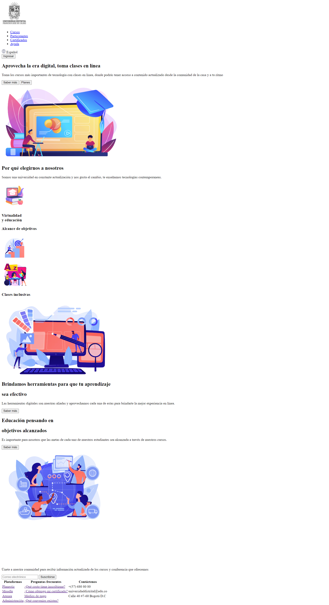
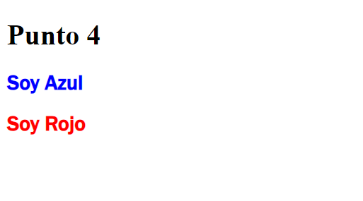

<h1> Taller Angelin Parra </h1>

<h2> Información</h2>
  
Curso: Full Básico Stack Grupo 1
    Profesor: Cristian Patiño

<h2> Punto 1: Link de figma</h2>
<a href="https://www.figma.com/proto/MiYScFG5DZ58cncTTqyWJO/Angelin-Parra---Figma-Excercise?node-id=1-297">Link de Figma</a>
<h2> Punto 2: HTML</h2>

<h2>Punto 3: CSS</h2>

<h2>Punto 4: Titulo de color</h2>
